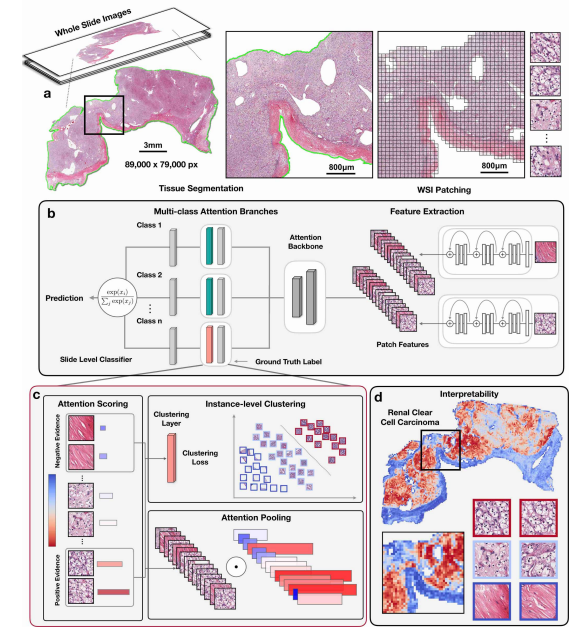

::github{repo="mahmoodlab/CLAM"}

### Abstract

基于深度学习的病理计算方法需要大量人力在整个WSI上使用slide级别的标注，监督学习和弱监督学习都需要话费大量人力。基于slide级别的计算方法还有领域适配、可解释性差和可视化等问题。因此我们提出了CLAM-Clustering-constrained Attention Multiple instance learning。该方法只需要slide级别的标注即可。该方法使用了基于弱监督学习的方法，并使用基于注意力机制的学习方法来自动确定那些地方有高诊断价值。

## CLAM: High-throughput, interpretable, weakly-supervised and data-efficient whole slide analysis

CLAM使用基于注意力机制的池化方法来聚类patch级别的特征为slide级别的特征来做分类。在high level下，模型对每个patch都进行打分，给每个patch一个attention score，说明了这个patch对这个slide分类的重要性。这种对注意力得分的解释体现在基于注意力池化的slide级聚合规则中，该规则将slide级表示计算为幻灯片中所有图块的加权平均值，其中权重由各自的注意力得分决定。CLAM和之前的MIL分类算法不一样，他用来处理多分类问题，他有n个并行的attention分支，每个都用来计算一个分类的表示，就像图1的B中显示的一样。最终每个类的特征使用分类层计算最终的权重。

标准的MIL算法并没有充分利用图片,因为他使用了最大池化,最终只收到了来自一个instance的梯度,这个缺点可以解释为什么需要大量的标注WSI图片来训练标准的MIL模型.为了克服这个缺点,我们使用了基于attention的pooling聚类算法,此外,我来使用了slide级别的标签和attention score来为每个低关注的和高关注的图片生成伪标签做为一种新的学习信号.在训练过程中,网络从额外的聚类最关注和最不关注的patch的监督学习中学习.例如，癌症亚型是互斥的；当某种亚型出现在全切片图像（WSI）中时，可以假设没有其他亚型的形态同时存在。根据互斥假设，除了对真实类别进行监督之外，我们还通过将高度关注的实例聚类为各自类别的“假阳性”证据，对其余类别的注意力网络分支进行监督。

我们首先把WSI分割为255\*255大小的切片,然后使用预训练的cnn模型来吧他们转为低维度embedding,这样可以节省内存减少计算量.

## 效果

他说很好那就很好吧~

## 讨论

CLAM解决了5个病理方向的主要问题:

1. 弱监督:只使用slide级别的标注
2. 数据高效:我们的模型能够在更少的数据上进行拟合
3. 可以在多分类任务上进行:不像其他的在2分类任务上进行的代码,我们的代码能够在多分类上进行
4. 泛用性:能在各种各样的WSI上训练
5. 可解释性:能够生成热图来辅助诊断

## 方法详解

CLAM建立在多实例学习框架之上，该框架将每个WSI（称为包）视为由许多（多达数十万）较小的区域或补丁（称为实例）组成.原始的MIL算法是二分类并且基于一阳则阳的逻辑的,这反应在max-pooling中,因为最大池化是不可训练的.相比之下,CLAM可以适应多分类任务,因为他没有使用max-pooling(或者平均池化等操作)而是使用了可训练,基于注意力机制的池化操作来聚类每个类的patch级别的表示来得到slide级别的表示.在我们的设计中,attention网络按照n个类得到n种不同的attention score,这使得模型可以学到不同类的知识而且不冲突.

### MIL

在CLAM中,第一个全连接层W1是512\*1024,把1024维度的项链转换为512大小,第二和第三个为256\*512(分别叫U和V).我们把前两个注意力网络层看为共用的attention backbone,然后分出n个branch,每个用一个简单的全连接层代替(1\*256),这样可以得到每个类的slide级别的分数.这样第k个切片的第m个类的分数表示为equ1(其实就是softmax),整个slide的第m个类的分数为equ2
$$
\begin{equation}
 a_{k,m} = \frac{\exp \left\{ W_{a,m} \left( \tanh \left( V_a h_k^T \right) \odot \sigma \left( U_a h_k^T \right) \right) \right\}}{\sum_{j=1}^{N} \exp \left\{ W_{a,m} \left( \tanh \left( V_a h_j^T \right) \odot \sigma \left( U_a h_j^T \right) \right) \right\}}
\end{equation}
$$
$$
\begin{equation}h_{\text{slide},m} = \sum_{k=1}^{N} a_{k,m} h_k\end{equation}
$$

最终把加了权重的h进行分类就可以了.

### Instance-level聚类(我觉得没啥用)

为了更好的学习特征,我们还加入了一个2类聚类的目标.对于n个类,我们都加入一个clustering layer(2\*512的全连接层)对h进行聚类.因为我们没有patch级别的标签,因此我们用attention网络输出了伪标签,我们只在模型强关注和几乎不关注的patch上进行优化.对于n个类,我们都可以转为2分类.对于一组有着score的patch,我们首先把他们排序,然后取头和尾各k个分别作为正类和负类,因此这个任务是线性可分的.这个任务是建立在互斥假设上的(不同癌症不能同时出现).

:::note
后面还有几个我任务不重要的点,有兴趣的可以自己看
:::

