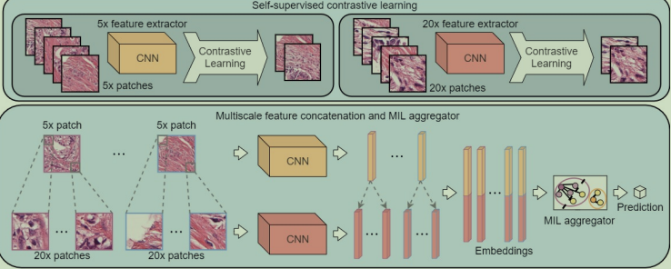
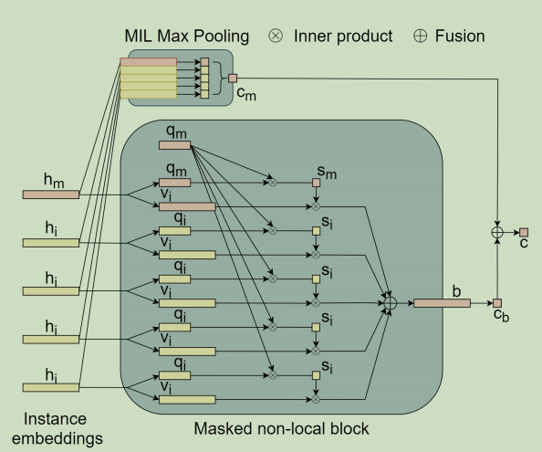
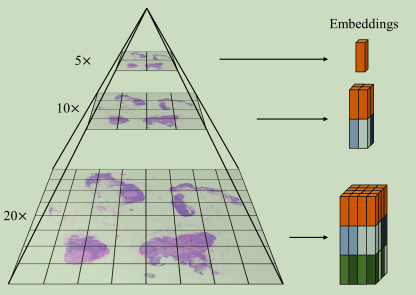
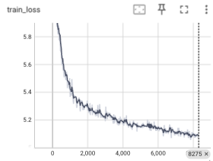
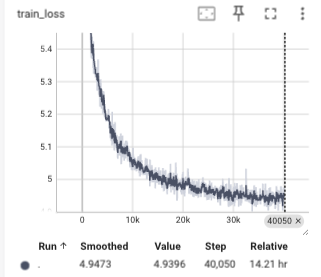

::github{repo="binli123/dsmil-wsi"}

## 前言

使用MIL算法进行全像素的运行，可以识别出其中的阳性与阴性区域
在诊断中，病理中阳性的区域范围其实少于20%，因此需要专家来进行标注，这种标注费时费力。
把一个wsi看成一个含有多个patch的bag，如果其中有一个阳性则阳性。patch级别的特征被提取然后聚类，最终变成slide级别的标签
但是当前主要问题为:如果阳性的切片非常少，使用简单的聚类操作的时候比如最大池化，会把模型分类分错。这是因为，在MIL的假设下，与完全监督的训练相比，最大池化会导致决策边界的转移

## MIL公式

在二分类中,$让B={(x_1,y_1)...(x_n,y_n)}$变成一个bag,其中y是对应示例x的标签,y∈{0,1},B的标签为
$$
c(B) = \begin{cases}
0, & \text{if } \sum y_i = 0 \\
1, & \text{otherwise}
\end{cases}
$$
MIL也会使用不同的变换f和**排列不变**的函数g来预测标签B
$$
c(B)=g(f(x_0)...f(x_n))
$$
根据f和g的选择,可以由两种MIL的建模方式

- 基于示例的方法:f是一个给每个示例打分的示例分类器,g是一个聚类所有示例从而得到bag分数的池化操作
- 基于嵌入的方法:f是一个示例级别的特征提取器,能把每个示例变成一个特征,g是一个聚类操作,能够把instance embedding变成bag embedding,
基于Embedding的方法直接由包标签监督的包嵌入生成包分数，通常比基于实例的方法具有更好的准确性，然而，通常更难确定触发分类器的关键实例。
在弱监督的WSI分类任务重,每个WSI都被认为是一个包并且从中提取出的patch被认为是示例.

## DSMIL分类

该文章的主要创新在于设计了一个新颖的聚类方法g和特征提取方法f的学习.具体来说，我们提出了DSMIL，它由一个掩码非局部块和一个用于特征聚合的最大池化块组成，输入实例嵌入由自监督对比学习得到。此外，DSMIL 使用金字塔策略结合了多尺度嵌入，从而确保了WSI中对图像块注意力的局部约束。

### MIL Aggregator with Masked Non-Local Operation

相比与之前的方法,DSMIL同时学习了示例分类器和bag分类器以及bag embedding
让$B=\{x_1...x_n\}$表示一个WSI包,每个patch都能通过特征提取器f映射为一个embedding$h_i=f(x_i)$

**第一个流**在每个示例embedding上使用示例分类器,并在后面使用了最大池化
$$
c_m(B)=max\{W_0H_0,...W_oH_{N-1}\}
$$
其中$W_0$是权重向量,因为最大池化是一个置换不变的操作,因此可以这么用

**第二个流**聚类了前面的示例Embedding变成bag Embedding,然后使用bag classifier进行打分.我们得到了最重要的embedding $h_m$ 然后把每个示例embedding h_i都转化为两个向量,一个是query和一个information.其中
$$
q_i=W_qh_i,v_=W_wh_i
$$
w表示权重,然后我们定义任意示例到重要示例的距离度量函数U
$$
U(\mathbf{h}_i, \mathbf{h}_m) = \frac{\exp(\langle \mathbf{q}_i, \mathbf{q}_m \rangle)}{\sum_{k=0}^{N-1} \exp(\langle \mathbf{q}_k, \mathbf{q}_m \rangle)}
$$
其中<>表示两个向量的内积.bag的embedding就是
$$
b=\sum^{N-1}_{i}U(h_i,h_m)v_i
$$
bag score就是
$$
c_b(B)=W_b\sum^{N-1}_{i}U(h_i,h_m)v_i
$$
这个操作类似self-attention,但是query只在关键instance和其他instance之间执行
点乘的用处是度量两个queries的相似度,相似的示例值越大,因此和hm越像的instance会有更大的权重.信息向量 \( v_i \) 的额外层允许在每个实例内提取贡献信息。方程 5 中的 softmax 操作确保无论 bag 的大小如何，注意力权重的和都等于 1。
:::tip
Softmax公式如下
$
\text{Softmax}(z)_i = \frac{e^{z_i}}{\sum_{j=1}^{n} e^{z_j}}
$
:::

最终的bag score的分数为两个流的和
$$
c(B)=\frac{1}{2} \left( \mathbf{W}_0 \mathbf{h}_m + \mathbf{W}_b \sum_{i} U(\mathbf{h}_i, \mathbf{h}_m) \mathbf{v}_i \right)
$$

### Self-Supervised Contrastive Learning of WSI Features

我们希望使用自监督对比学习来学习特征提取器f,使用一种叫做SimCLR的先进的特征提取器,能够在不需要人工标签的情况下学习到鲁棒的表示。用于 SimCLR 的数据集由从 WSIs 中提取的图块组成。这些图块密集地裁剪，没有重叠，并作为独立图像用于 SimCLR 训练。

### Locally-Constrained Multiscale Attention

最后我们还使用了一种金字塔链接策略来整合了来自不同放大倍数的wsi的特征.
对于低放大倍数的patch,我们获取他的特征和他的子patch(拥有更大放大倍数)的特征,比如224\*224在10倍放大的,我们获取4个224\*224在20倍放大的图片

## 自己的实验

我使用自己的数据集在他的代码上进行了运作,效果还是可以的.我使用的数据集为LUAD和LUSS两种癌症数据集中的匹配项(即对应的病理图片有对应的CT图).

在第一次的时候,我首先按照5放大和20放大进行了切分,然后我分别在5倍放大和20倍放大上使用了默认参数的特征提取.我使用了Resnet18来进行特征提取.然后再使用他的代码进行运行.非常遗憾,得到的结果很差,大概AUC只有60%

而后,~~我痛定思痛~~,我认为可能是初步特征提取的时候没有做好,是resnet18的特征学习能力太差了,需要使用更加深层的网络.于是我才用了resnet50来再一次进行特征提取.使用resnet50之后的模型变慢了,需要好好等等,我在3张3090上进行了训练,batch_size为396,训练的tensorboard如下:

当然了,我可以在上面的low放大倍数的上面再训练一会让他更加拟合,下面的是训练了一个晚上的成果,他完全拟合了,上面的可以再多训练一会,,不过问题不大.

训练完特征提取器之后我们计算特征并且进行拼接,每个特征变成4096维度的特征,然后放进去训练,最终得到的结果还是比较好的,

> Mean Accuracy: 0.8041
>
> Class 0: Mean AUC = 0.8446
>
> Class 1: Mean Auc = 0.8443
