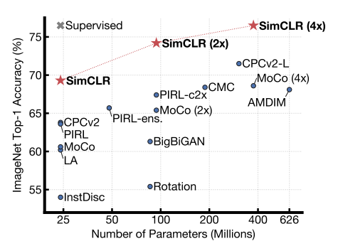

::github{repo="google-research/simclr"}

[Self-Supervised Learning 超详细解读 (二)：SimCLR系列 - 知乎 (zhihu.com)](https://zhuanlan.zhihu.com/p/378953015)

## 前言

self-supervised learning,又叫自监督学习,是无监督学习中的一种,主要希望能学习到一种通用的特征表达用于下游任务(Downstream Tasks),比如病理分类中就用了这种方式,先学习特征,把图片转为低维Embedding后再处理,其主要的方式就是自己监督自己.自监督学习也是大势所趋.总结来说,自监督学习的方法就是:**Unsuperviesd Pre-train,Supervised Fine-tune**.

在预训练阶段使用无标签数据集,因为人工标签太贵了.在训练模型参数的时候我们不追求用带标签数据把模型一步训练到位,而是先训练初步成型,然后再训练到完全成型.前面这个使用无标签数据初步成型的东西叫做**Visual Representation**,然后再使用下游任务用带标签的数据把他完全训练成型,这个时候数据就不需要太多了.

第一个阶段不涉及任何下游任务,就是拿着一堆无标签数据训练就好了,这个用官方的表述叫做:**in a task-agnostic way**,第二个阶段有了标签和下游任务上做Fine-tune,这个叫做**in a task-specific way**.

本文主要介绍Self-Supervised Learning 在 **CV 领域** 的经典工作之一：SimCLR和SimCLR v2，它们都是属于 **Contrastive** 类别的。

## 原理分析



SimCLR在ImageNet上达到了76.5%的Top1准确率,如果把这个预训练模型用 **1%的ImageNet的标签**给 **Fine-tune** 一下，借助这一点点的有监督信息，SimCLR 就可以再达到 **85.5%** 的 **Top 5** Accuracy，

SimCLR也是遵循前言中的训练方法,他的核心就是Contrastive,就是试图教会机器区分相似和不同的事物.比如我们现在有4张图片,我们希望前面两张狗尽可能相似,与第三四张尽可能不同.但是由于我们没有标签,因此很难做到这个事情.


所以SimCLR的方法如下:

假设现在有一张图片x佳作Original Image,首先对他数据增强,得到两张增强后的图片$x_i,x_j$,数据增强方式有如下三种:

- 随机裁剪后resize成原来的样子(Random crooping followed by resize back to the original size)
- 随机色彩失真(Random Color distortions)
- 随机高斯模糊(Random Gaussian Deblur)

然后把增强后的图片输入到Encoder里,注意这两个Encoder共享参数的,得到他们的representation$h_i,h_j$,在把$h_i,h_j$通过Projection head得到representaiton$z_i,z_j$.这里的projection head依旧共享参数.其中$$z_i = g(h_i) = W^{(2)} \sigma(W^{(1)} h_i)$$.接下来就是需要最大化同一张图片得到的$z_i,z_j$.这就是他的方法概述.


## 具体实现

### 数据增强

在论文中的batch_size是8192.我们假设N=2.数据增强的代码如下:

```python
torchvision:transforms:RandomResizedCrop

from torchvision import transforms
def get_color_distortion(s=1.0):
# s is the strength of color distortion.
    color_jitter = transforms.ColorJitter(0.8*s, 0.8*s, 0.8*s, 0.2*s)
    rnd_color_jitter = transforms.RandomApply([color_jitter], p=0.8)
    rnd_gray = transforms.RandomGrayscale(p=0.2)
    color_distort = transforms.Compose([
    rnd_color_jitter,
    rnd_gray])

    return color_distort
  
random (crop + flip + color jitter + grayscale)
```

对同一个图片我么能够得到两个不同的数据增强的结果,所以一个Batch有4个Image.

### 通过Encoder获得图片表征

我们使用ResNet50作为Encoder,输出2048维向量h

### 预测头

预测头是一个双层MLP,将2048维度向量映射到128维度空间中,得到新的representation$z_i,z_j$.然后去计算loss完成训练.训练完可以扔掉预测头.

### 相似图片输出更近

到这一步后对于每个Batch,我们都能得到他们的visual represenstation $z_i$.

首先我们要定义Representation之间的相似度,比如余弦相似度Cosine Similarity,这样我们就能把两个图片的相似度转换为两个representaion之间的计算：$$s_{i,j} = \frac{z_i^\top z_j}{\tau \|z_i\| \|z_j\|}$$.式中，$\tau$ 是可调节的 Temperature 参数。它能够 scale 输入并扩展余弦相似度 [-1, 1]这个范围。

理想情况下狗狗之间的相似度高,狗和鲸鱼的相似度低.


到现在我们有了衡量相似度的方法,但是最终还是要转为可以优化的损失函数才可以.文中开发了一种叫NT-Xent loss (Normalized Temperature-Scaled Cross-Entropy Loss)的对比损失函数.具体方法如下:

首先我们拿出来第一个pair(比如是两只狗),使用softmax计算两图像相似的概率.

为了让softmax的结果尽可能大,所以我们对softmax取了负对数.
$$
l(i, j) = - \log \frac{\exp(s_{i,j})}{\sum_{k=1}^{2N} \mathbf{1}[k \ne i] \exp(s_{i,k})}
$$
然后我们把图片调换位置后再计算一次,最后计算所有pair的损失函数和的平均値.

### 下游任务Fine-tune

到这里我们已经在没有任何标签的情况下训练好了SimCLR模型,让他的Encoder可以输出图片的Representation信息.可以用于迁移学习了.这个时候需要的数据量很小.

